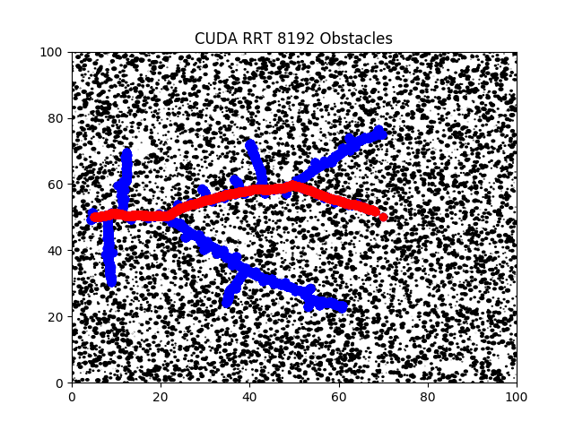
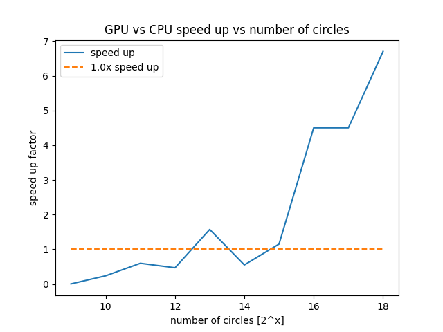

# Massively Parallelized Rapidly-Exploring Random Tree
### Josh Cohen and Boston Cleek

## Abstract
The goal of this project was to explore the possibilities of utilizing massively parallel processors to parallelize the Rapidly-Exploring Random Trees algorithm. Collision checking was found to be the most significant bottleneck, therefore research efforts were focused on paralellizing this aspect of the algorithm. A naive approach was implemented and analyzed, while the infrastructure for further optimizations were built out and the nature of those optimizations are discussed. It was found that for search spaces in which the obstacle count was greater than 2048 the massively parallel implementation on a GPU outperformed the same algorithm run on a CPU, further it was found that future implementations should work to ensure CUDA threads are performing useful computation with techniques such as binning and thread coarsening.  

## Instructions to Run
* run the rrt executable with `./rrt arg1 ag2`make sure you have an rrtout folder in the same directory
	* arg1 - random number seed (default 10)
	* arg2 - number of circles to run with (default 2048)

* to visualize call the visualizer.py script with `python3 visualizer.py` make 
sure the rrtout folder is in the same directory
	* this script depends on numpy and matplotlib
	* if you executed the rrt on the Wilkenson server or another headless server you will likely have to transfer the generated rrtout folder back to a machine that can visualize the graph

## Results
We were able to implement a massively parallelized implementation of the RRT algorithm that demonstrated performance improvements over conventional, CPU implementations when the number of obstacles checked was greater than 2048 as can be seen in the figure below, also included is an example solution computed on the GPU.

## File Structure
main.cpp
* creates an rrt instance
* seeds the random number generator 
* instantiates number of circles

rrt.cpp & rrt.hpp
* defines the rrt object
* calls parallel and serial implementations
* implements writing data out functionality

collision_check.cu & collision_check.h
* defines kernel1-3 implementations for CUDA
* defines wrapper for calling kernels
